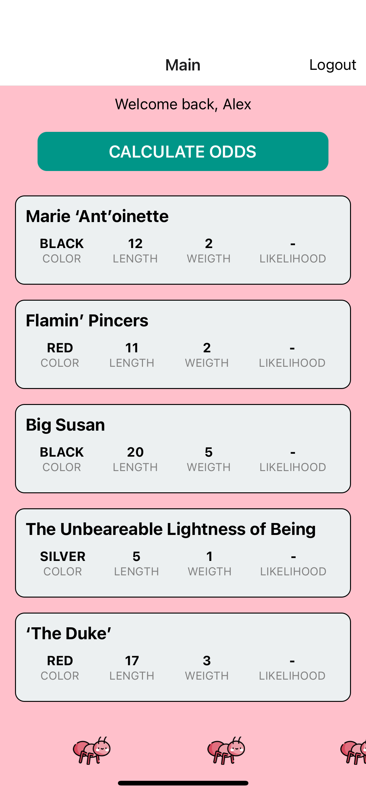

# Ants Racing

React Native take home test.


{:height="50%" width="50%"}
{:height="50%" width="50%"}

### Deliverables

#### Must Haves

- [x] Users must be able to begin running calculations on all ants simultaneously.
- [x] UI must reflect the state of each ant's win likelihood calculation (not yet run, in progress, calculated, etc.)
- [x] UI must display the state of *all* tests together (not yet run, in progress, all calculated).
- [x] As the results come in, ants must be ordered by their calculated likelihood of winning.
- [x] Login and Logout functionalities.
- [x] Display ants' marquee upon login.


#### Bonus Features

- Show `n` number of ants and tie the animation of each to its associated calculation via a method of your choosing
- Clever / aesthetically pleasing transitions

## Installation

```bash
cd ant_racing/ && yarn install
```

iOS Simulator
```bash
yarn ios
```

android Simulator
```bash
yarn android
```


